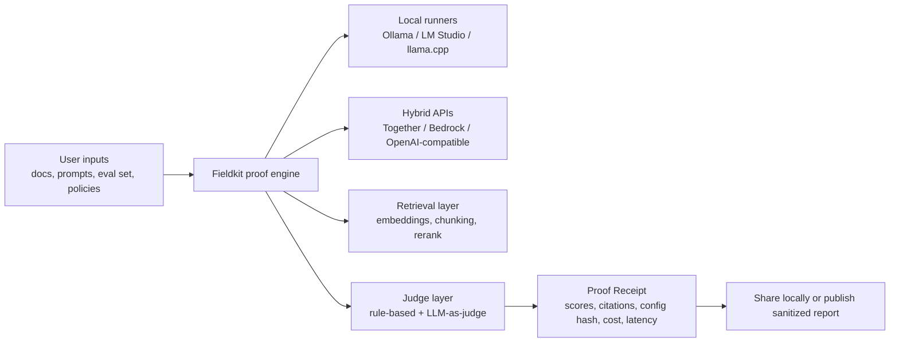
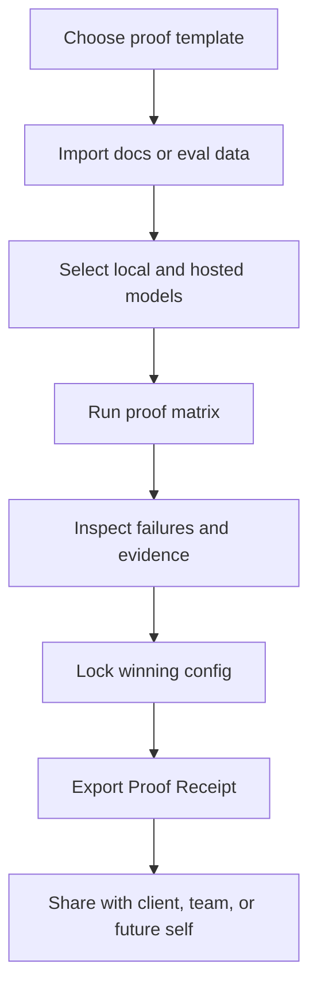

# Orionfold Proof Receipt Opportunity

## Executive summary

The strongest solo-founder opportunity is **not** another local model runner, training stack, or generic agent platform. Those categories already have very large open-source and commercial incumbents: Ollama has about **174k GitHub stars**, **100M+ Docker pulls**, and **40,000+ community integrations**; Open WebUI has about **139k GitHub stars**; LM Studio is **free for work use**, runs **locally and offline**, and now ships **headless deployments**, CLI, SDKs, and a Hub/plugin surface. Competing head-on there would mean fighting on breadth, packaging, and infrastructure polish against products with much larger distribution. citeturn0search1turn23search2turn29search2turn25search0turn13search1turn13search7turn12search7turn12search6turn13search4turn30search4

A better wedge is a **Proof Receipt** product: a **local-first, hybrid-capable verification system** that runs repeatable proof jobs across local and hosted models, checks RAG grounding and model behavior, and produces a signed, shareable receipt with evidence, configs, latency, cost, and trust metrics. That lands in the gap between runners like Ollama/LM Studio and full-stack enterprise observability products like Langfuse, Braintrust, Promptfoo, and Confident AI. It is narrow enough for a bootstrap founder, but valuable enough that adjacent vendors already charge for trust, eval, and observability layers. citeturn10search1turn10search2turn14search1turn14search2turn14search3turn35search1turn35search3

Why now: demand signals are real. RAG-related search demand is rising; one Google Trends overlay estimates **“RAG” at 340k monthly searches and +389% YoY growth**. Communities focused on local AI are massive, with **r/LocalLLaMA at about 740k members**, **r/LocalLLM at about 167k**, and **r/ollama at about 123k**. Stack Overflow already shows **264 Ollama-tagged questions**, **171 Amazon Bedrock questions**, and **95 retrieval-augmented-generation questions**. AWS has also productized the category by making **Model Evaluation**, **LLM-as-a-judge**, and **RAG Evaluation** generally available in Bedrock. This is no longer “nice to have” tooling; trust evaluation is becoming table stakes. citeturn4search0turn8search0turn8search1turn8search2turn1search1turn1search2turn1search3turn35search2turn35search3turn35search4turn35search10

The recommendation is to build **one product** with this shape: **open-core local engine + local web cockpit + minimal hosted services**, sold self-serve to consultants, small AI teams, and privacy-sensitive builders. This also matches the direction implied by the earlier internal strategy review: the opportunity is broader than a DGX-only audience and stronger when Orionfold becomes a trust layer rather than a compute-specific shell. fileciteturn0file0

## Demand signals

The clearest signal is the sheer size of the local and hybrid model ecosystem. Ollama’s GitHub and Docker numbers, Open WebUI’s star count, Langfuse’s **10M+ Docker pulls**, and Langfuse’s **171,146 weekly npm downloads** show that builders increasingly expect AI infrastructure to be **self-hostable, observable, and composable**. Meanwhile, Hugging Face model pages for Qwen show **multi-million download counts**, which indicates active experimentation with open models rather than curiosity alone. citeturn23search2turn25search0turn23search1turn21search0turn7search2

The communities are not only large; they express the exact pain that “Proof Receipt” solves. In r/LocalLLaMA, users say public benchmarks are “mere curiosity” and want **custom evals on real tasks**. Other threads focus on whether a model is fast enough, fits available RAM/VRAM, works on private documents, or survives daily use after the leaderboard hype fades. Hacker News posts about local RAG emphasize privacy, local storage, and the difficulty of using the same model for both generation and evaluation on constrained hardware. Stack Overflow questions center on wrong citations, hallucinations, parameter normalization across providers, and Bedrock document-processing edge cases. citeturn2reddit37turn2reddit38turn3search0turn3search2turn1search4turn1search2

The enterprise side of the market is converging on the same theme. Bedrock now supports **evaluation of Bedrock and non-Bedrock models**, **LLM-as-a-judge**, and **RAG evaluation for custom pipelines**, while SageMaker emphasizes reducing benchmarking and deployment optimization from **weeks to hours**. Recent job postings ask for **RAG expertise**, **eval suites**, **hallucination management**, **auditability**, **traceability**, and experience with Bedrock or SageMaker. That is buyer language for “prove this works before I trust it.” citeturn35search1turn35search2turn35search3turn36search3turn9search1turn9search4turn9search10

| Signal | Evidence | Why it matters |
|---|---|---|
| Search interest | “RAG” estimated at **340k/mo** and **+389% YoY** in a Google Trends overlay dataset. citeturn4search0 | Discovery demand exists outside the dev bubble. |
| OSS runtime adoption | Ollama **174k GitHub stars**, **100M+ Docker pulls**. citeturn0search1turn23search2 | Local/hybrid inference is mainstreaming. |
| UI/adoption surface | Open WebUI **~139k GitHub stars**. citeturn25search0 | Users want accessible local interfaces, not just APIs. |
| Observability/evals adoption | Langfuse **10M+ Docker pulls**, **171,146 weekly npm downloads**, **40,000+ builders**. citeturn23search1turn21search0turn14search2 | Teams will install and pay for trust tooling. |
| Community size | r/LocalLLaMA **~740k**, r/LocalLLM **~167k**, r/ollama **~123k**. citeturn8search0turn8search1turn8search2 | Large bottom-up distribution pool for PLG. |
| Q&A demand | Stack Overflow: **264** Ollama, **171** Bedrock, **95** RAG questions. citeturn1search1turn1search2turn1search3 | Persistent operational pain, not one-off novelty. |
| Official platformization | Bedrock GA for **Model Evaluation**, **LLM-as-a-judge**, **RAG Evaluation**. citeturn35search2turn35search3turn35search4 | The trust layer is becoming infrastructure, validating the category. |

## Competitor landscape

The market splits into two layers. The first layer runs models: Ollama, LM Studio, Unsloth Studio, Bedrock, SageMaker, Together, Modal. The second layer measures trust and quality: Promptfoo, Langfuse, Braintrust, Confident AI, Ragas. Orionfold’s opportunity is **between** them: not another runner, not a broad enterprise observability suite, but a **private proof-and-verification harness** tuned for local and hybrid use.

| Product | Domain | Core fit vs Proof Receipt | Pricing and model | Funding raised | Employees | Packaging / distribution | Target ICP | Sources |
|---|---|---|---|---|---|---|---|---|
| Ollama | Local and hybrid runtime | Substitute for execution layer, not proofing | Free; Pro **$20/mo**; Max **$100/mo**; usage-based cloud included, local unlimited | Not publicly disclosed in reviewed sources | LinkedIn lists **2–10** | CLI, API, desktop apps, Docker, cloud | Developers, prosumers, local-first teams | citeturn29search2turn11view0turn37search0 |
| LM Studio | Local runner and local RAG | Substitute for local cockpit, not trust layer | Free for home and work use; Team/Enterprise custom | Not publicly disclosed in reviewed sources | Official blog said **9 people** in 2025; LinkedIn lists **2–10** | Desktop app, headless daemon, CLI, JS/Python SDKs, Hub/plugins | Local AI teams, researchers, prosumers | citeturn13search1turn12search7turn12search6turn13search7turn37search4 |
| Unsloth | Local training / fine-tuning | Adjacent for small-compute builders | Free OSS; Pro and Enterprise custom | Not publicly disclosed in reviewed sources | LinkedIn lists **11–50** | OSS library, Studio web UI, local/offline | Fine-tuners, local AI builders | citeturn14search0turn18search2 |
| Promptfoo | Evals, red teaming, AppSec | Direct competitor on testing, weaker on local-first proof UX | OSS free; Enterprise and On-Prem custom | Financial terms undisclosed; being acquired by OpenAI | LinkedIn lists **11–50** | CLI, library, self-host, enterprise cloud/on-prem | AI engineers, security teams | citeturn10search2turn28search0turn18search0 |
| Langfuse | Observability, prompts, evals | Direct competitor for trace/eval layer | Cloud: Free, **$29/mo**, **$199/mo**; self-host OSS free | **$4M seed** before acquisition; later acquired by ClickHouse | Exact size not public in reviewed sources | SaaS + self-host + Docker + SDKs | AI teams shipping to production | citeturn14search2turn14search3turn29search1turn28search2turn28search4 |
| Braintrust | Observability and evals | Direct competitor at higher-end team workflows | Free; Pro **$249/mo**; Enterprise custom | Officially announced **$80M Series B**; LinkedIn shows earlier **$36M Series A** | LinkedIn lists **51–200** | SaaS, on-prem enterprise, SDK/CLI | AI-native product teams | citeturn10search1turn29search0turn19search0 |
| Confident AI / DeepEval | Eval platform and OSS test framework | Direct competitor on eval workflows | Free; Starter from **$19.99/user/mo** | Not public in reviewed sources; YC W25 | LinkedIn lists **11–50** | Cloud platform + Python OSS | Small teams needing tests and reports | citeturn14search1turn26search0turn37search1 |
| Amazon Bedrock | Managed model access, evals, RAG | Adjacent platform partner and competitor for hosted proofing | Usage-based by model; extra charges for guardrails, KBs, evals | N/A | N/A | Managed API/service in AWS | Enterprise and regulated cloud users | citeturn17search0turn35search1turn35search3 |
| Amazon SageMaker AI | Full build/train/deploy stack | Adjacent scale-compute platform | Pay-as-you-go or Savings Plans | N/A | N/A | Managed service for training, deployment, HyperPod | Scale ML / GenAI teams | citeturn16search1turn36search1turn36search3turn36search0 |

The strategic reading of this table is simple: **execution is crowded, trust is valuable, and the local/hybrid trust niche is still under-served**. Existing local products are broad runners. Existing eval products skew cloud-first or enterprise-first. Bedrock and SageMaker validate that evaluation is important, but they are too broad, too AWS-specific, and too infrastructure-heavy to be the preferred tool for the privacy-first small team. citeturn35search1turn35search3turn36search3

## Buyers and market sizing

The best buyers are not giant enterprises. They are people who already feel the pain and can buy self-serve.

The first persona is the **AI consultant / boutique agency**. They must compare models, chunking strategies, and prompt scaffolds for client work, often under NDA. They need a client-facing artifact they can attach to a proposal or delivery handoff. Their willingness to pay is supported by the existence of paid eval tooling from **$19.99/user** up to **$249/month** and enterprise tiers beyond that. citeturn14search1turn10search1turn14search2

The second persona is the **product or platform lead at a 5–50 person software company** building internal RAG or agent workflows. Job postings repeatedly ask for hallucination control, auditability, and evaluation frameworks. AWS users complain about Bedrock costs, quotas, and stale model catalogs, which creates demand for an independent proof layer that works across local and hosted providers. citeturn9search1turn9search4turn27reddit62turn37reddit61turn37reddit64

The third persona is the **privacy-sensitive knowledge worker or prosumer researcher**. HN and Reddit threads around local archives, Apple Notes, and personal knowledge bases show a clear preference for local processing, especially when dealing with journals, contracts, internal documentation, or client material. citeturn3search0turn3search8turn3search7

A practical sizing model is bottom-up and deliberately conservative. The “reachable global practitioner pool” is not additive across communities, but the overlap-adjusted market still looks meaningful when triangulated from **r/LocalLLaMA (~740k)**, **Together AI’s 450k developers**, **Langfuse’s 40k+ builders**, large OSS pull/download counts, and active Q&A/job demand. A reasonable working range is **400k–800k** globally relevant builders and small teams. If **15%–25%** of that population is willing to pay **$300–$900/year**, the long-run TAM is roughly **$18M–$180M**. A realistic self-serve English-language SAM for a solo founder is more like **15k–40k paying accounts**, or roughly **$9M–$36M** at a **$600–$900** blended annual contract value. A 3-year bootstrap SOM of **2,500–4,000 paying accounts** is enough to reach the target outcome. citeturn8search0turn27news48turn14search2turn23search2

## Product design and architecture

The product should be designed around a single job: **“prove that this model or RAG setup is good enough for this private use case.”** The user does not start with code. They start with: a dataset or doc set, a target task, candidate models, and acceptance criteria. The product runs a proof, compares configurations, and emits a receipt.

A crisp MVP should look like this:

| Priority | Capability | User story |
|---|---|---|
| P0 | Local runner adapters for Ollama and LM Studio; OpenAI-compatible remote adapter; dataset import; matrix runs; simple RAG pipeline; config hashing; receipt export | “As a consultant, I can compare Qwen local vs Bedrock Claude on my client’s doc set and export a report with evidence.” |
| P0 | Core trust metrics: citation coverage, citation precision, faithfulness/hallucination, answer relevance, latency, cost | “As a product lead, I can tell whether a cheaper model is acceptable for my actual workflow.” |
| P1 | Policy packs for finance, healthcare, sales ops, internal knowledge base QA; human review queues; regression testing; diffing between runs | “As a repeat user, I can rerun the same proof monthly and detect drift.” |
| P1 | Hybrid privacy controls: local-only mode, redact-before-cloud mode, signed receipts, encrypted local project vault | “As a privacy-sensitive team, I can prove what left the machine and what did not.” |
| P2 | Shareable public Field Notes with “Run this proof” button; community template library; LM Studio/Ollama packaging integrations | “As a creator, I can turn research content into a runnable acquisition loop.” |

The stack should reflect the product thesis. Use **Python** for the engine and adapters, with **FastAPI**, **Pydantic**, **Typer**, **uv**, **SQLite/DuckDB**, and a pluggable vector layer such as **FAISS** or **LanceDB**. The cockpit can be a **local web app** in **React + TypeScript + Vite**, persisted locally by default. Package the open-core engine as a **pipx/uv tool** and optionally as a **desktop shell** later, but avoid app-store dependency at the start. Minimal hosted services should be limited to licensing, anonymous update checks, optional crash reporting, and public receipt hosting for users who opt in. The point is to make the product deeply useful with **no hosted account required**. That positioning is reinforced by how LM Studio, Ollama, Langfuse self-hosting, and local RAG communities are already behaving. citeturn13search7turn11view0turn14search3turn3search7

## Pricing, distribution, and strategic power

A workable bootstrap pricing system is:

| Tier | Price | Includes | Likely buyer |
|---|---:|---|---|
| Free | $0 | Local-only runs, 1 project, community templates, receipt export watermark | Prosumer, evaluator |
| Solo | $29/mo | Unlimited local projects, hybrid adapters, private receipts, CSV/PDF export | Independent consultant |
| Pro | $99/mo | Team sharing, regression runs, policy packs, human review, signed receipts | Small product team |
| Studio | $399/mo | 5 seats, reusable templates, white-label reports, priority support | Boutique agency / AI studio |
| Proof Sprint | $1,500 one-time | Done-with-you 2-week proof engagement and setup | High-intent buyer |

A credible path to the user’s lifestyle goal is visible in the math:

| Scenario | Solo accounts | Pro accounts | Studio accounts | Proof Sprints per year | ARR |
|---|---:|---:|---:|---:|---:|
| Base | 1,600 | 900 | 350 | 210 | **$3.20M** |
| Upside | 2,000 | 1,200 | 500 | 250 | **$5.27M** |
| Leaner mix | 2,300 | 700 | 250 | 300 | **$3.06M** |

The key point is that you do **not** need enterprise sales to get there. You need a few thousand paying accounts and a modest service layer that doubles as onboarding and market validation.

Distribution should follow three channels. First, **SEO and research publishing**. A recent benchmark on Product Hunt discovery argues that products often disappear from generic LLM discovery queries, while traditional SEO signals such as referring domains still predict visibility. That makes Orionfold-style **Field Notes** more valuable than launch-day theatrics. Second, **workshops and paid Proof Sprints**. These are not consulting as the business model; they are conversion mechanisms and market research. Third, **ecosystem placement**: NVIDIA Inception offers co-marketing, partner offers, and hardware/software benefits; Ollama has a large integrations surface; LM Studio has a Hub/plugin ecosystem; Modal is available through AWS and GCP marketplaces; Together has a large multi-model developer base and transparent usage pricing. citeturn24academia41turn30search0turn30search3turn30search4turn31search3turn27news48

The seven powers are mixed. **Branding** is achievable if “Proof Receipt” becomes synonymous with *evidence-backed AI setups*. **Process power** is achievable through a repeatable proof methodology and report format. **Switching costs** can emerge if receipts become historical benchmarks and policy packs become embedded in customer workflows. **Counter-positioning** is plausible because cloud incumbents are optimized either for broad infrastructure or team observability, not for local-first, privacy-first, self-serve proofing. **Network effects**, **economies of scale**, and **cornered resource** are weak at the start, so the company should not pretend otherwise. The wedge is craftsmanship, clarity, and trust velocity, not infrastructure muscle. citeturn28search0turn28search2turn29search0

A compact Business Model Canvas follows naturally: the value proposition is **private proof of AI quality**; customer segments are consultants, small AI teams, and privacy-sensitive builders; channels are research content, templates, workshops, and integrations; revenue is subscription plus Proof Sprints; key resources are the engine, proof templates, benchmark datasets, and brand; key activities are shipping adapters, publishing proof content, and tuning policy packs; partners are NVIDIA Inception, local runner ecosystems, Together, AWS, and Modal; costs are mostly founder time plus minimal cloud/license services.

## Validation plan and roadmap

The first three experiments should be brutally simple. **Experiment A** is an A/B landing page test: “private AI proof runs” versus “Proof Receipts for local and hybrid models.” Measure CTR to signup, email capture, and demo request rate. **Experiment B** is a paid **Proof Sprint** offer for one vertical, likely internal RAG or sales/ops knowledge bases. Measure close rate, time-to-first-proof, and whether buyers ask for ongoing software access. **Experiment C** is a **Field Note + run button**: publish a detailed comparison of two local models and one Bedrock/Together model, then let readers clone the proof template. Measure template clones, local installs, and receipt exports. These experiments directly test message resonance, willingness to pay, and activation. They also fit how this market already learns: through community writeups, reproducible examples, and practical comparisons. citeturn2reddit37turn3search9turn35search3

Your KPIs should be activation-heavy, not vanity-heavy: time to first proof run, proof completion rate, percentage of runs that produce a saved receipt, repeat proofs per workspace, proof-to-paid conversion, Proof Sprint attach rate, and the share of receipts that are exported or shared. In a product like this, **receipt creation and repeat proofing** are stronger signals than pageviews or stars.

The roadmap is straightforward. In the first **90 days**, ship P0: local engine, adapters, matrix runs, receipt export, and one or two opinionated proof templates. Success means at least **20 paid pilots or Sprints**, **100 active proof runs**, and clear evidence that users repeat proofs. In **180 days**, add Pro features: policy packs, regression testing, team sharing, and hybrid privacy controls. Success means **$20k–$40k MRR** and a stable content-to-product funnel. By **365 days**, the goal is not feature parity with Braintrust or Langfuse; it is category ownership of the phrase and workflow **“Proof Receipt.”** Success means **$1M+ ARR run rate**, a library of reusable proof templates, and enough community mindshare that new local/hybrid evaluation content naturally references your workflow. citeturn14search2turn10search1turn10search2

## Open questions and limitations

Some company funding and employee figures are **not publicly disclosed** in primary sources, especially for Ollama, LM Studio, Unsloth, and Confident AI; where unavailable, this report says so rather than guessing. Search-trend data for “RAG” comes from a **Google Trends overlay tool**, which is useful directionally but not as authoritative as official Google Ads search volume. Finally, overlap across Reddit, GitHub, and vendor communities is substantial, so TAM/SAM/SOM estimates here should be treated as **decision ranges**, not precise market census figures. citeturn4search0turn8search0turn8search1turn27news48